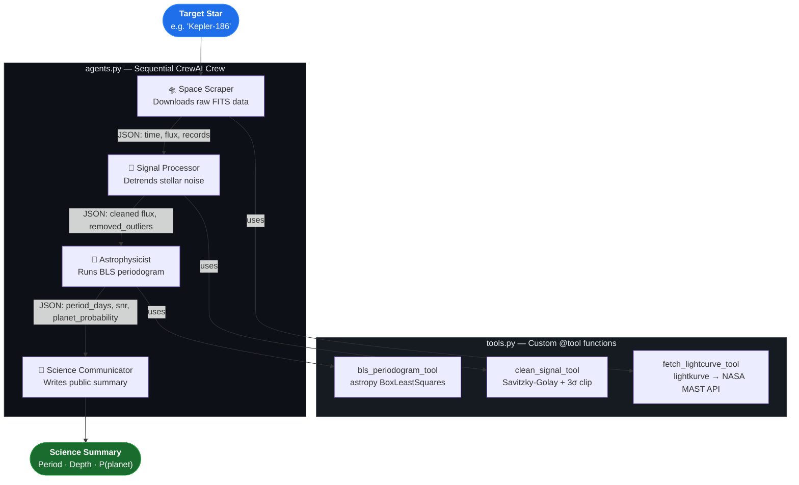

# Exoplanet Swarm 🚀🌟

> A production-ready multi-agent CrewAI pipeline that autonomously ingests raw NASA telescope data, processes the photometric signal, runs Box-fitting Least Squares (BLS) transit detection, and produces a public-facing science summary — all with no manual data download required.

---

## Architecture

The project is organized into three files with clean separation of concerns:

| File | Responsibility |
|------|---------------|
| `tools.py` | All NASA MAST data retrieval, signal processing, and BLS math (`@tool` functions). Zero LLM imports. |
| `agents.py` | CrewAI Agent and Task definitions. Lazy LLM initialization. Imports from `tools.py`. |
| `main.py` | Entry point. Imports `make_crew()` from `agents.py` and runs `kickoff()`. |

### Pipeline flow



### Four Agents

| Agent | Tool | Responsibility |
|-------|------|----------------|
| **Space Scraper** | `fetch_lightcurve_tool` | Queries MAST, stitches Kepler/TESS quarters, normalizes flux |
| **Signal Processor** | `clean_signal_tool` | Savitzky-Golay detrending + 3σ outlier removal |
| **Astrophysicist** | `bls_periodogram_tool` | BLS periodogram over 5,000 trial periods → period / depth / SNR / probability |
| **Science Communicator** | *(LLM only)* | Translates raw numbers into a clear 2-paragraph public summary |

---

## Quickstart

### 1. Install dependencies

```bash
pip install -r requirements.txt
```

### 2. Set your OpenAI API key

```bash
export OPENAI_API_KEY=sk-...
```

> **Swap LLMs**: Replace `ChatOpenAI` in `agents.py` with any LangChain-compatible provider (Anthropic, Gemini, Ollama, etc.).

### 3. Run the pipeline

```bash
# Default target: Kepler-186
python main.py

# Override target star via CLI
python main.py "TOI 700"
python main.py "Kepler-442"
```

### 4. Generate visualizations

```bash
# Fetch live from MAST + plot
python visualize.py "Kepler-186"

# Use cached fixtures (fast, offline after first run)
python visualize.py --cached
```

Outputs a 4-panel dark-theme PNG:
- Raw normalized light curve
- Detrended & cleaned light curve
- BLS power spectrum with period annotations
- Phase-folded light curve at best-fit orbital period

---

## Running Tests

```bash
pip install pytest
```

```bash
# Fast unit tests (fully mocked, no network)
pytest tests/ -v -m unit

# Integration tests against REAL Kepler-186 MAST data
# (downloads ~146k cadences on first run, caches to tests/fixtures/)
pytest tests/ -v -m integration

# Everything
pytest tests/ -v
```

### What the integration tests validate

The integration suite (`TestRealKepler186Data`) fetches actual Kepler-186 photometry from NASA MAST and asserts:

- `records > 10,000` cadences retrieved (returns 146,046 in practice — 4 years of Kepler data)
- Flux is normalized near 1.0
- Time array is strictly monotonically increasing after the sort applied in `fetch_lightcurve_tool`
- Cleaning reduces flux scatter vs raw
- **BLS best period falls within 15% of a known confirmed orbit (or its alias):**

| Planet | Period (days) |
|--------|--------------|
| Kepler-186 b | 3.887 |
| Kepler-186 c | 7.267 |
| Kepler-186 d | 13.342 |
| Kepler-186 e | 22.408 |
| Kepler-186 f | 129.945 ← habitable zone |

- Transit depth is physically plausible (100–10,000 ppm)
- Planet probability > 30% for real Kepler data

Test fixtures are cached to `tests/fixtures/` so MAST is only hit once per machine.

---

## Architecture Details

### `tools.fetch_lightcurve_tool`
- Tries Kepler PDCSAP_FLUX first, falls back to TESS SPOC
- Downloads up to 8 quarters/sectors and stitches them
- Normalizes by median flux; removes NaN cadences
- Sorts by time to eliminate inter-quarter seam artifacts

### `tools.clean_signal_tool`
- **Stage 1**: Savitzky-Golay filter (window ≈ 1% of series, always odd, cubic polynomial) divides out slow stellar variability
- **Stage 2**: 3σ sigma-clipping removes cosmic rays and momentum dumps
- Window is intentionally narrow to preserve short-duration transit dips

### `tools.bls_periodogram_tool`
- Tests 5,000 log-spaced trial periods from 0.5 days to baseline/3
- Tests 4 duration hypotheses (0.05, 0.10, 0.15, 0.20 days) simultaneously
- SNR = peak\_power / median\_power
- Planet probability: `P = 1 − exp(−SNR / 10)` (heuristic proxy, not Bayesian posterior)
- Detection quality: `Strong (SNR≥15)` / `Moderate (≥7)` / `Weak (≥3)` / `Noise (<3)`

---

## Project Structure

```
zerve-ai/
├── tools.py               # @tool functions — NASA fetch, signal clean, BLS math
├── agents.py              # CrewAI agents, tasks, make_crew()
├── main.py                # Entry point: python main.py "Kepler-186"
├── visualize.py           # 4-panel diagnostic plot (dark theme, matplotlib)
├── requirements.txt       # Python dependencies
├── pytest.ini             # Custom pytest marks (unit, integration)
├── README.md
├── .gitignore
└── tests/
    ├── conftest.py                  # Session-scoped MAST fixtures (cached)
    └── test_exoplanet_swarm.py      # 15 unit + 10 integration tests
```

---

## Target Stars to Try

| Star | Why it's interesting |
|------|---------------------|
| `Kepler-186` | 5 planets; Earth-size planet in habitable zone (186f) |
| `Kepler-442` | Super-Earth in habitable zone, high habitability score |
| `TOI 700` | TESS habitable zone Earth-size planet |
| `Kepler-62` | Two habitable zone planets (62e, 62f) |
| `TRAPPIST-1` | 7 Earth-size planets; 3 in habitable zone |

---

## Dependencies

| Package | Purpose |
|---------|---------|
| `crewai` | Multi-agent orchestration |
| `langchain-openai` | LLM interface |
| `lightkurve` | NASA MAST data retrieval |
| `astropy` | BLS periodogram, units |
| `scipy` | Savitzky-Golay filter |
| `numpy` | Numerical operations |
| `pandas` | DataFrame handling |
| `matplotlib` | Visualization |
